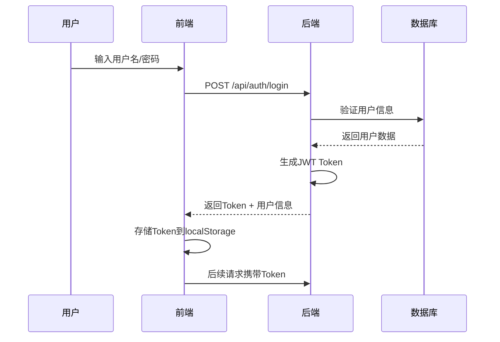

# 城市智慧应急协同调度平台 - 需求设计文档

## 1. 项目概述

### 1.1 项目简介
城市智慧应急协同调度平台是一个高集成、高性能的城市级应急指挥中心系统。系统在二维地图上实时集成全市范围内的应急资源（人员、车辆、物资、传感器），提供复杂的空间分析能力，辅助指挥员在突发事件中进行资源动态调度、路径规划与态势复盘。

### 1.2 技术栈

| 层次 | 技术选型 |
|------|---------|
| **前端** | React 18 + Ant Design 5 + OpenLayers 9.0+ |
| **后端** | Node.js (Express/Koa2) |
| **数据库** | MySQL 8.0+ |
| **空间计算** | Turf.js, Proj4.js |
| **实时通信** | WebSocket (Socket.io) |
| **渲染辅助** | WebGL, Canvas API, Web Worker |

---

## 2. 系统架构设计

### 2.1 整体架构

```
┌─────────────────────────────────────────────────────────────────┐
│                        前端展示层                                 │
│  ┌───────────────┐  ┌───────────────┐  ┌───────────────┐       │
│  │  React 组件    │  │ Ant Design    │  │ OpenLayers    │       │
│  │  (UI交互)     │  │ (组件库)      │  │ (地图渲染)    │       │
│  └───────────────┘  └───────────────┘  └───────────────┘       │
└─────────────────────────────────────────────────────────────────┘
                              ↕ HTTP/WebSocket
┌─────────────────────────────────────────────────────────────────┐
│                       后端服务层                                  │
│  ┌───────────────┐  ┌───────────────┐  ┌───────────────┐       │
│  │  认证服务     │  │  资源服务     │  │  空间分析     │       │
│  │  (Auth)       │  │  (Resource)   │  │  (Spatial)    │       │
│  └───────────────┘  └───────────────┘  └───────────────┘       │
│  ┌───────────────┐  ┌───────────────┐  ┌───────────────┐       │
│  │  WebSocket    │  │  调度服务     │  │  回放服务     │       │
│  │  (实时推送)   │  │  (Dispatch)   │  │  (Playback)   │       │
│  └───────────────┘  └───────────────┘  └───────────────┘       │
└─────────────────────────────────────────────────────────────────┘
                              ↕ SQL/Socket
┌─────────────────────────────────────────────────────────────────┐
│                        数据持久层                                 │
│  ┌───────────────┐  ┌───────────────┐  ┌───────────────┐       │
│  │    MySQL      │  │  Redis缓存    │  │  文件存储     │       │
│  │  (关系数据)   │  │  (热点数据)   │  │  (轨迹/图片)  │       │
│  └───────────────┘  └───────────────┘  └───────────────┘       │
└─────────────────────────────────────────────────────────────────┘
```

### 2.2 前端架构

```
src/
├── pages/                    # 页面组件
│   ├── Login/               # 登录页
│   ├── Dashboard/           # 指挥大屏
│   ├── ResourceMonitor/     # 资源监控
│   ├── SpatialAnalysis/     # 空间分析
│   ├── TacticalPlotting/    # 战术标绘
│   └── Playback/            # 轨迹回放
├── components/              # 公共组件
│   ├── Map/                 # 地图组件
│   │   ├── OLLayer/        # OpenLayers图层
│   │   ├── WebGLLayer/     # WebGL渲染层
│   │   └── Controls/       # 地图控件
│   ├── Resource/            # 资源组件
│   └── Auth/               # 认证组件
├── services/                # 服务层
│   ├── auth.service.ts      # 认证服务
│   ├── resource.service.ts  # 资源服务
│   ├── spatial.service.ts   # 空间分析服务
│   └── websocket.service.ts # WebSocket服务
├── store/                   # 状态管理
├── utils/                   # 工具函数
│   ├── map/                # 地图工具
│   ├── spatial/            # 空间计算工具
│   └── performance/        # 性能优化工具
└── types/                   # TypeScript类型定义
```

### 2.3 后端架构

```
src/
├── controllers/             # 控制器
│   ├── auth.controller.ts
│   ├── resource.controller.ts
│   ├── spatial.controller.ts
│   └── dispatch.controller.ts
├── services/                # 业务逻辑层
│   ├── auth.service.ts
│   ├── resource.service.ts
│   ├── spatial.service.ts
│   └── websocket.service.ts
├── models/                  # 数据模型
│   ├── User.ts
│   ├── Resource.ts
│   ├── Incident.ts
│   └── Trajectory.ts
├── middlewares/             # 中间件
│   ├── auth.middleware.ts   # 认证中间件
│   ├── error.middleware.ts  # 错误处理
│   └── rateLimit.middleware.ts # 限流
├── routes/                  # 路由
├── utils/                   # 工具函数
└── websocket/               # WebSocket处理
```

---

## 3. 功能模块设计

### 3.1 用户认证模块

#### 3.1.1 登录流程


#### 3.1.2 API接口

| 接口 | 方法 | 描述 | 认证 |
|------|------|------|------|
| `/api/auth/login` | POST | 用户登录 | 否 |
| `/api/auth/logout` | POST | 用户登出 | 是 |
| `/api/auth/refresh` | POST | 刷新Token | 是 |
| `/api/auth/info` | GET | 获取当前用户信息 | 是 |

---

### 3.2 高性能全域资源监控模块

#### 3.2.1 功能描述
- 海量点位渲染（>50,000个动态点位）
- 多模态聚合展示
- 状态实时同步（WebSocket）

#### 3.2.2 数据库设计

**资源表 (t_resource)**
```sql
CREATE TABLE t_resource (
    id VARCHAR(36) PRIMARY KEY COMMENT '资源ID（UUID）',
    resource_type VARCHAR(50) NOT NULL COMMENT '资源类型：vehicle/person/sensor/material',
    resource_name VARCHAR(100) NOT NULL COMMENT '资源名称',
    resource_status VARCHAR(20) NOT NULL COMMENT '状态：online/offline/alarm/processing',
    longitude DECIMAL(11, 8) NOT NULL COMMENT '经度',
    latitude DECIMAL(11, 8) NOT NULL COMMENT '纬度',
    properties JSON COMMENT '扩展属性',
    department_id VARCHAR(36) COMMENT '所属部门ID',
    created_at TIMESTAMP DEFAULT CURRENT_TIMESTAMP,
    updated_at TIMESTAMP DEFAULT CURRENT_TIMESTAMP ON UPDATE CURRENT_TIMESTAMP,
    INDEX idx_location (longitude, latitude),
    INDEX idx_status (resource_status),
    INDEX idx_type (resource_type)
) ENGINE=InnoDB DEFAULT CHARSET=utf8mb4 COMMENT='应急资源表';
```

**资源类型表 (t_resource_type)**
```sql
CREATE TABLE t_resource_type (
    id VARCHAR(36) PRIMARY KEY COMMENT '类型ID',
    type_code VARCHAR(50) NOT NULL UNIQUE COMMENT '类型编码',
    type_name VARCHAR(100) NOT NULL COMMENT '类型名称',
    icon_url VARCHAR(255) COMMENT '图标URL',
    color VARCHAR(20) COMMENT '显示颜色',
    sort_order INT DEFAULT 0 COMMENT '排序',
    created_at TIMESTAMP DEFAULT CURRENT_TIMESTAMP
) ENGINE=InnoDB DEFAULT CHARSET=utf8mb4 COMMENT='资源类型表';
```

#### 3.2.3 前端实现方案

```typescript
// WebGL渲染层配置
const webglPointsLayer = new WebGLPointsLayer({
  source: new VectorSource({
    features: [], // 50000+ 要素
  }),
  style: {
    'icon-src': '/icons/resource.png',
    'icon-width': 32,
    'icon-height': 32,
    'icon-color': ['get', 'statusColor'],
  },
});

// 聚合图层配置
const clusterLayer = new WebGLPointsLayer({
  source: new ClusterSource({
    distance: 40,
    source: resourceSource,
  }),
  style: createClusterStyle, // Canvas饼图样式
});
```

---

### 3.3 动态态势空间分析模块

#### 3.3.1 功能描述
- 多重等时圈分析（5/10/15分钟到达圈）
- 动态缓冲区与过滤
- 自由套索查询（Lasso Query）

#### 3.3.2 数据库设计

**事件表 (t_incident)**
```sql
CREATE TABLE t_incident (
    id VARCHAR(36) PRIMARY KEY COMMENT '事件ID',
    incident_type VARCHAR(50) NOT NULL COMMENT '事件类型',
    incident_level VARCHAR(20) NOT NULL COMMENT '等级：minor/major/severe',
    title VARCHAR(200) NOT NULL COMMENT '事件标题',
    description TEXT COMMENT '事件描述',
    longitude DECIMAL(11, 8) NOT NULL COMMENT '经度',
    latitude DECIMAL(11, 8) NOT NULL COMMENT '纬度',
    incident_status VARCHAR(20) NOT NULL COMMENT '状态：pending/processing/resolved',
    reported_by VARCHAR(36) COMMENT '上报人ID',
    reported_at TIMESTAMP DEFAULT CURRENT_TIMESTAMP COMMENT '上报时间',
    resolved_at TIMESTAMP NULL COMMENT '解决时间',
    created_at TIMESTAMP DEFAULT CURRENT_TIMESTAMP,
    INDEX idx_location (longitude, latitude),
    INDEX idx_status (incident_status),
    INDEX idx_level (incident_level)
) ENGINE=InnoDB DEFAULT CHARSET=utf8mb4 COMMENT='应急事件表';
```

**敏感建筑表 (t_sensitive_building)**
```sql
CREATE TABLE t_sensitive_building (
    id VARCHAR(36) PRIMARY KEY COMMENT '建筑ID',
    building_type VARCHAR(50) NOT NULL COMMENT '类型：school/hospital/station',
    building_name VARCHAR(200) NOT NULL COMMENT '建筑名称',
    longitude DECIMAL(11, 8) NOT NULL COMMENT '经度',
    latitude DECIMAL(11, 8) NOT NULL COMMENT '纬度',
    address VARCHAR(500) COMMENT '地址',
    capacity INT COMMENT '容纳人数',
    properties JSON COMMENT '扩展属性',
    created_at TIMESTAMP DEFAULT CURRENT_TIMESTAMP,
    INDEX idx_location (longitude, latitude),
    INDEX idx_type (building_type)
) ENGINE=InnoDB DEFAULT CHARSET=utf8mb4 COMMENT='敏感建筑表';
```

#### 3.3.3 API接口

| 接口 | 方法 | 描述 | 参数 |
|------|------|------|------|
| `/api/spatial/isochrone` | POST | 生成等时圈 | `{ lng, lat, minutes: [5,10,15] }` |
| `/api/spatial/buffer` | POST | 生成缓冲区 | `{ lng, lat, radius }` |
| `/api/spatial/query` | POST | 空间查询 | `{ polygon: [[lng,lat],...] }` |
| `/api/spatial/buildings` | GET | 查询敏感建筑 | `{ within: polygon }` |

---

### 3.4 协同标绘与战术调度模块

#### 3.4.1 功能描述
- 智能路径吸附（Snapping）
- 复杂战术符号绘制
- 路径动态规划

#### 3.4.2 数据库设计

**标绘表 (t_plotting)**
```sql
CREATE TABLE t_plotting (
    id VARCHAR(36) PRIMARY KEY COMMENT '标绘ID',
    plotting_type VARCHAR(50) NOT NULL COMMENT '类型：route/arrow/polygon/point',
    plotting_name VARCHAR(100) COMMENT '标绘名称',
    geometry GEOJSON NOT NULL COMMENT '几何数据（GeoJSON）',
    properties JSON COMMENT '属性数据',
    creator_id VARCHAR(36) NOT NULL COMMENT '创建人ID',
    incident_id VARCHAR(36) COMMENT '关联事件ID',
    created_at TIMESTAMP DEFAULT CURRENT_TIMESTAMP,
    updated_at TIMESTAMP DEFAULT CURRENT_TIMESTAMP ON UPDATE CURRENT_TIMESTAMP,
    INDEX idx_type (plotting_type),
    INDEX idx_incident (incident_id)
) ENGINE=InnoDB DEFAULT CHARSET=utf8mb4 COMMENT='战术标绘表';
```

**调度任务表 (t_dispatch_task)**
```sql
CREATE TABLE t_dispatch_task (
    id VARCHAR(36) PRIMARY KEY COMMENT '任务ID',
    task_type VARCHAR(50) NOT NULL COMMENT '任务类型',
    task_status VARCHAR(20) NOT NULL COMMENT '状态：pending/executing/completed',
    priority INT DEFAULT 0 COMMENT '优先级',
    resource_id VARCHAR(36) NOT NULL COMMENT '资源ID',
    incident_id VARCHAR(36) NOT NULL COMMENT '事件ID',
    route_geojson JSON COMMENT '路线GeoJSON',
    estimated_arrival TIMESTAMP COMMENT '预计到达时间',
    actual_arrival TIMESTAMP COMMENT '实际到达时间',
    dispatcher_id VARCHAR(36) NOT NULL COMMENT '调度员ID',
    created_at TIMESTAMP DEFAULT CURRENT_TIMESTAMP,
    completed_at TIMESTAMP NULL,
    INDEX idx_status (task_status),
    INDEX idx_resource (resource_id),
    INDEX idx_incident (incident_id)
) ENGINE=InnoDB DEFAULT CHARSET=utf8mb4 COMMENT='调度任务表';
```

---

### 3.5 时空大数据回放模块

#### 3.5.1 功能描述
- 多车同步插值回放（100辆车）
- 时序动态热力图
- 60FPS流畅回放

#### 3.5.2 数据库设计

**轨迹表 (t_trajectory)**
```sql
CREATE TABLE t_trajectory (
    id VARCHAR(36) PRIMARY KEY COMMENT '轨迹ID',
    resource_id VARCHAR(36) NOT NULL COMMENT '资源ID',
    longitude DECIMAL(11, 8) NOT NULL COMMENT '经度',
    latitude DECIMAL(11, 8) NOT NULL COMMENT '纬度',
    speed DECIMAL(6, 2) COMMENT '速度（km/h）',
    direction DECIMAL(6, 2) COMMENT '方向（度）',
    recorded_at TIMESTAMP NOT NULL COMMENT '记录时间',
    received_at TIMESTAMP DEFAULT CURRENT_TIMESTAMP COMMENT '接收时间',
    INDEX idx_resource_time (resource_id, recorded_at),
    INDEX idx_time_range (recorded_at)
) ENGINE=InnoDB DEFAULT CHARSET=utf8mb4 COMMENT='轨迹数据表';
```

**热力图数据表 (t_heatmap_data)**
```sql
CREATE TABLE t_heatmap_data (
    id VARCHAR(36) PRIMARY KEY,
    data_type VARCHAR(50) NOT NULL COMMENT '数据类型：alarm/incident',
    longitude DECIMAL(11, 8) NOT NULL COMMENT '经度',
    latitude DECIMAL(11, 8) NOT NULL COMMENT '纬度',
    intensity INT NOT NULL COMMENT '强度值',
    event_time TIMESTAMP NOT NULL COMMENT '事件时间',
    INDEX idx_time (event_time),
    INDEX idx_location (longitude, latitude)
) ENGINE=InnoDB DEFAULT CHARSET=utf8mb4 COMMENT='热力图数据表';
```

#### 3.5.3 回放核心算法

```typescript
// 轨迹插值函数
function interpolateTrajectory(
  points: TrajectoryPoint[],
  targetFPS: number = 60
): TrajectoryPoint[] {
  const result: TrajectoryPoint[] = [];
  const interval = 1000 / targetFPS;

  for (let i = 0; i < points.length - 1; i++) {
    const p1 = points[i];
    const p2 = points[i + 1];
    const timeDiff = p2.recorded_at - p1.recorded_at;

    // 线性插值
    const steps = Math.ceil(timeDiff / interval);
    for (let j = 0; j < steps; j++) {
      const ratio = j / steps;
      result.push({
        longitude: p1.longitude + (p2.longitude - p1.longitude) * ratio,
        latitude: p1.latitude + (p2.latitude - p1.latitude) * ratio,
        speed: p1.speed + (p2.speed - p1.speed) * ratio,
        direction: p1.direction + (p2.direction - p1.direction) * ratio,
        recorded_at: p1.recorded_at + timeDiff * ratio,
      });
    }
  }

  return result;
}
```

---

## 4. 数据库设计规范

### 4.1 通用字段规范

所有表遵循以下规范：
- **id**: 所有主键使用 `VARCHAR(36)` 存储UUID
- **时间字段**: 使用 `TIMESTAMP` 类型
- **软删除**: 支持 `deleted_at` 字段
- **扩展字段**: 使用 `JSON` 类型存储非结构化数据

### 4.2 核心表汇总

| 表名 | 说明 | 主要字段 |
|------|------|---------|
| `t_user` | 用户表 | id, username, password, role, department_id |
| `t_department` | 部门表 | id, name, parent_id |
| `t_resource` | 资源表 | id, resource_type, status, longitude, latitude |
| `t_resource_type` | 资源类型表 | id, type_code, type_name, icon_url |
| `t_incident` | 事件表 | id, type, level, status, longitude, latitude |
| `t_sensitive_building` | 敏感建筑表 | id, type, name, longitude, latitude |
| `t_plotting` | 标绘表 | id, type, geometry (GeoJSON), creator_id |
| `t_dispatch_task` | 调度任务表 | id, status, resource_id, incident_id, route |
| `t_trajectory` | 轨迹表 | id, resource_id, longitude, latitude, recorded_at |
| `t_heatmap_data` | 热力图数据 | id, type, intensity, event_time |
| `t_system_log` | 系统日志表 | id, user_id, action, module, ip_address |
| `t_notification` | 通知消息表 | id, receiver_id, type, content, read_status |
| `t_map_config` | 地图配置表 | id, config_type, config_key, config_value |
| `t_alert_rule` | 告警规则表 | id, rule_name, condition, action, enabled |

### 4.3 系统辅助表设计

**系统日志表 (t_system_log)**
```sql
CREATE TABLE t_system_log (
    id VARCHAR(36) PRIMARY KEY COMMENT '日志ID',
    user_id VARCHAR(36) COMMENT '用户ID',
    username VARCHAR(100) COMMENT '用户名',
    action VARCHAR(50) NOT NULL COMMENT '操作类型：login/logout/create/update/delete',
    module VARCHAR(50) COMMENT '模块名称',
    method VARCHAR(100) COMMENT '请求方法',
    params TEXT COMMENT '请求参数',
    ip_address VARCHAR(50) COMMENT 'IP地址',
    user_agent VARCHAR(500) COMMENT '用户代理',
    status VARCHAR(20) COMMENT '状态：success/failure',
    error_message TEXT COMMENT '错误信息',
    execution_time INT COMMENT '执行时间(ms)',
    created_at TIMESTAMP DEFAULT CURRENT_TIMESTAMP COMMENT '创建时间',
    INDEX idx_user (user_id),
    INDEX idx_action (action),
    INDEX idx_created (created_at)
) ENGINE=InnoDB DEFAULT CHARSET=utf8mb4 COMMENT='系统日志表';
```

**通知消息表 (t_notification)**
```sql
CREATE TABLE t_notification (
    id VARCHAR(36) PRIMARY KEY COMMENT '通知ID',
    receiver_id VARCHAR(36) NOT NULL COMMENT '接收人ID',
    sender_id VARCHAR(36) COMMENT '发送人ID',
    notification_type VARCHAR(50) NOT NULL COMMENT '通知类型：incident/alert/system/task',
    title VARCHAR(200) NOT NULL COMMENT '标题',
    content TEXT COMMENT '内容',
    related_id VARCHAR(36) COMMENT '关联业务ID',
    read_status VARCHAR(20) DEFAULT 'unread' COMMENT '阅读状态：unread/read',
    sent_at TIMESTAMP DEFAULT CURRENT_TIMESTAMP COMMENT '发送时间',
    read_at TIMESTAMP NULL COMMENT '阅读时间',
    INDEX idx_receiver (receiver_id),
    INDEX idx_read_status (read_status),
    INDEX idx_sent_at (sent_at)
) ENGINE=InnoDB DEFAULT CHARSET=utf8mb4 COMMENT='通知消息表';
```

**地图配置表 (t_map_config)**
```sql
CREATE TABLE t_map_config (
    id VARCHAR(36) PRIMARY KEY COMMENT '配置ID',
    config_type VARCHAR(50) NOT NULL COMMENT '配置类型：basemap/layers/style',
    config_key VARCHAR(100) NOT NULL COMMENT '配置键',
    config_value TEXT NOT NULL COMMENT '配置值（JSON）',
    description VARCHAR(500) COMMENT '描述',
    is_public BOOLEAN DEFAULT FALSE COMMENT '是否公开',
    created_by VARCHAR(36) COMMENT '创建人ID',
    created_at TIMESTAMP DEFAULT CURRENT_TIMESTAMP,
    updated_at TIMESTAMP DEFAULT CURRENT_TIMESTAMP ON UPDATE CURRENT_TIMESTAMP,
    UNIQUE KEY uk_type_key (config_type, config_key),
    INDEX idx_type (config_type)
) ENGINE=InnoDB DEFAULT CHARSET=utf8mb4 COMMENT='地图配置表';
```

**告警规则表 (t_alert_rule)**
```sql
CREATE TABLE t_alert_rule (
    id VARCHAR(36) PRIMARY KEY COMMENT '规则ID',
    rule_name VARCHAR(200) NOT NULL COMMENT '规则名称',
    rule_type VARCHAR(50) NOT NULL COMMENT '规则类型：resource_offline/incident_level/area_density',
    condition JSON NOT NULL COMMENT '触发条件（JSON）',
    action VARCHAR(50) NOT NULL COMMENT '告警动作：notify/email/sms/webhook',
    action_config JSON COMMENT '动作配置',
    severity VARCHAR(20) DEFAULT 'medium' COMMENT '严重程度：low/medium/high/critical',
    enabled BOOLEAN DEFAULT TRUE COMMENT '是否启用',
    created_by VARCHAR(36) NOT NULL COMMENT '创建人ID',
    created_at TIMESTAMP DEFAULT CURRENT_TIMESTAMP,
    updated_at TIMESTAMP DEFAULT CURRENT_TIMESTAMP ON UPDATE CURRENT_TIMESTAMP,
    INDEX idx_type (rule_type),
    INDEX idx_enabled (enabled)
) ENGINE=InnoDB DEFAULT CHARSET=utf8mb4 COMMENT='告警规则表';
```

### 4.3 用户权限设计

**用户表 (t_user)**
```sql
CREATE TABLE t_user (
    id VARCHAR(36) PRIMARY KEY COMMENT '用户ID',
    username VARCHAR(50) NOT NULL UNIQUE COMMENT '用户名',
    password_hash VARCHAR(255) NOT NULL COMMENT '密码哈希',
    real_name VARCHAR(100) COMMENT '真实姓名',
    phone VARCHAR(20) COMMENT '手机号',
    email VARCHAR(100) COMMENT '邮箱',
    role VARCHAR(20) NOT NULL COMMENT '角色：admin/operator/dispatcher/viewer',
    department_id VARCHAR(36) COMMENT '部门ID',
    status VARCHAR(20) DEFAULT 'active' COMMENT '状态：active/inactive/locked',
    last_login_at TIMESTAMP NULL COMMENT '最后登录时间',
    created_at TIMESTAMP DEFAULT CURRENT_TIMESTAMP,
    updated_at TIMESTAMP DEFAULT CURRENT_TIMESTAMP ON UPDATE CURRENT_TIMESTAMP,
    FOREIGN KEY (department_id) REFERENCES t_department(id),
    INDEX idx_role (role),
    INDEX idx_dept (department_id)
) ENGINE=InnoDB DEFAULT CHARSET=utf8mb4 COMMENT='用户表';
```

**部门表 (t_department)**
```sql
CREATE TABLE t_department (
    id VARCHAR(36) PRIMARY KEY COMMENT '部门ID',
    name VARCHAR(100) NOT NULL COMMENT '部门名称',
    parent_id VARCHAR(36) COMMENT '上级部门ID',
    level INT DEFAULT 0 COMMENT '层级',
    sort_order INT DEFAULT 0 COMMENT '排序',
    created_at TIMESTAMP DEFAULT CURRENT_TIMESTAMP,
    FOREIGN KEY (parent_id) REFERENCES t_department(id),
    INDEX idx_parent (parent_id)
) ENGINE=InnoDB DEFAULT CHARSET=utf8mb4 COMMENT='部门表';
```

---

## 5. API接口设计

### 5.1 接口规范

- **基础URL**: `/api/v1`
- **认证方式**: JWT Bearer Token
- **响应格式**: JSON
- **状态码**: 遵循HTTP标准

#### 5.1.1 统一响应格式

```typescript
// 成功响应
{
  "code": 200,
  "message": "success",
  "data": { ... }
}

// 错误响应
{
  "code": 400,
  "message": "参数错误",
  "error": "具体错误信息"
}
```

### 5.2 核心API列表

#### 5.2.1 认证接口

| 接口 | 方法 | 描述 |
|------|------|------|
| `/api/v1/auth/login` | POST | 用户登录 |
| `/api/v1/auth/logout` | POST | 用户登出 |
| `/api/v1/auth/refresh` | POST | 刷新Token |
| `/api/v1/auth/info` | GET | 获取用户信息 |

#### 5.2.2 资源管理接口

| 接口 | 方法 | 描述 |
|------|------|------|
| `/api/v1/resources` | GET | 获取资源列表 |
| `/api/v1/resources/:id` | GET | 获取资源详情 |
| `/api/v1/resources` | POST | 创建资源 |
| `/api/v1/resources/:id` | PUT | 更新资源 |
| `/api/v1/resources/:id` | DELETE | 删除资源 |
| `/api/v1/resources/nearby` | GET | 查询附近资源 |
| `/api/v1/resources/stats` | GET | 资源统计 |

#### 5.2.3 事件管理接口

| 接口 | 方法 | 描述 |
|------|------|------|
| `/api/v1/incidents` | GET | 获取事件列表 |
| `/api/v1/incidents/:id` | GET | 获取事件详情 |
| `/api/v1/incidents` | POST | 上报事件 |
| `/api/v1/incidents/:id` | PUT | 更新事件 |
| `/api/v1/incidents/:id/close` | POST | 结案事件 |

#### 5.2.4 空间分析接口

| 接口 | 方法 | 描述 |
|------|------|------|
| `/api/v1/spatial/isochrone` | POST | 生成等时圈 |
| `/api/v1/spatial/buffer` | POST | 生成缓冲区 |
| `/api/v1/spatial/within` | POST | 空间范围查询 |
| `/api/v1/spatial/distance` | POST | 距离计算 |

#### 5.2.5 调度接口

| 接口 | 方法 | 描述 |
|------|------|------|
| `/api/v1/dispatch/tasks` | GET | 获取调度任务 |
| `/api/v1/dispatch/tasks` | POST | 创建调度任务 |
| `/api/v1/dispatch/tasks/:id` | PUT | 更新任务状态 |
| `/api/v1/dispatch/route` | POST | 路径规划 |

#### 5.2.6 回放接口

| 接口 | 方法 | 描述 |
|------|------|------|
| `/api/v1/playback/trajectory` | GET | 获取轨迹数据 |
| `/api/v1/playback/heatmap` | GET | 获取热力图数据 |
| `/api/v1/playback/timeline` | GET | 获取时间轴事件 |

---

## 6. WebSocket实时通信设计

### 6.1 连接管理

```typescript
// 前端连接
const socket = io('wss://api.example.com', {
  auth: {
    token: localStorage.getItem('token')
  },
  transports: ['websocket'],
  reconnection: true,
  reconnectionDelay: 1000,
  reconnectionDelayMax: 30000,
  reconnectionAttempts: 5
});

// 事件订阅
socket.on('resource:update', (data) => {
  // 资源状态更新
  updateResourceOnMap(data);
});

socket.on('incident:new', (data) => {
  // 新事件上报
  showNewIncidentAlert(data);
});

socket.on('trajectory:update', (data) => {
  // 轨迹实时更新
  updateTrajectory(data);
});
```

### 6.2 消息类型

| 消息类型 | 方向 | 描述 | 数据格式 |
|---------|------|------|---------|
| `resource:update` | 服务端→客户端 | 资源状态变更 | `{ id, status, lng, lat, properties }` |
| `resource:batch` | 服务端→客户端 | 批量资源更新 | `{ updates: [{ id, status, lng, lat }] }` |
| `incident:new` | 服务端→客户端 | 新事件上报 | `{ id, type, level, lng, lat, title }` |
| `incident:update` | 服务端→客户端 | 事件状态更新 | `{ id, status, handler_id }` |
| `task:created` | 服务端→客户端 | 调度任务创建 | `{ id, resource_id, incident_id, route }` |
| `task:update` | 服务端→客户端 | 任务状态更新 | `{ id, status, progress }` |
| `trajectory:update` | 服务端→客户端 | 轨迹实时推送 | `{ resource_id, points: [{ lng, lat, time }] }` |
| `alert:broadcast` | 服务端→客户端 | 系统广播消息 | `{ type, title, content, level }` |
| `map:sync` | 双向 | 地图状态同步 | `{ zoom, center, layers }` |
| `drawing:sync` | 双向 | 标绘协同 | `{ type, geometry, creator_id }` |

### 6.3 后端实现（Node.js + Socket.IO）

```typescript
// websocket/gateway.ts
import { Server } from 'socket.io';
import { verifyToken } from '../utils/auth';

class WebSocketGateway {
  private io: Server;
  private userSockets: Map<string, Set<string>> = new Map();

  constructor(httpServer: any) {
    this.io = new Server(httpServer, {
      cors: {
        origin: process.env.FRONTEND_URL,
        credentials: true
      },
      pingTimeout: 30000,
      pingInterval: 25000
    });

    this.setupMiddleware();
    this.setupEventHandlers();
  }

  private setupMiddleware() {
    // JWT认证中间件
    this.io.use(async (socket, next) => {
      try {
        const token = socket.handshake.auth.token;
        const decoded = await verifyToken(token);
        socket.data.userId = decoded.userId;
        socket.data.userName = decoded.userName;
        next();
      } catch (err) {
        next(new Error('Authentication failed'));
      }
    });
  }

  private setupEventHandlers() {
    this.io.on('connection', (socket) => {
      const userId = socket.data.userId;
      console.log(`User connected: ${userId}`);

      // 记录用户Socket连接
      if (!this.userSockets.has(userId)) {
        this.userSockets.set(userId, new Set());
      }
      this.userSockets.get(userId)!.add(socket.id);

      // 加入房间（按部门/角色）
      socket.on('join-room', (room: string) => {
        socket.join(room);
        console.log(`User ${userId} joined room: ${room}`);
      });

      // 发送消息到房间
      socket.on('room-message', (data: { room: string, event: string, payload: any }) => {
        socket.to(data.room).emit(data.event, data.payload);
      });

      // 断开连接
      socket.on('disconnect', () => {
        const sockets = this.userSockets.get(userId);
        if (sockets) {
          sockets.delete(socket.id);
          if (sockets.size === 0) {
            this.userSockets.delete(userId);
          }
        }
        console.log(`User disconnected: ${userId}`);
      });
    });
  }

  // 广播资源更新（仅推送到视口内的用户）
  broadcastResourceUpdate(data: ResourceUpdate) {
    this.io.emit('resource:update', data);
  }

  // 发送给特定用户
  sendToUser(userId: string, event: string, data: any) {
    const sockets = this.userSockets.get(userId);
    if (sockets) {
      sockets.forEach(socketId => {
        this.io.to(socketId).emit(event, data);
      });
    }
  }

  // 发送到房间
  sendToRoom(room: string, event: string, data: any) {
    this.io.to(room).emit(event, data);
  }
}

export default WebSocketGateway;
```

### 6.4 消息队列集成

```typescript
// services/spatial.service.ts
import { EventEmitter } from 'events';

class SpatialAnalysisService extends EventEmitter {
  // 等时圈计算完成后推送
  async calculateIsochrone(params: IsochroneParams) {
    const result = await this.performIsochroneCalculation(params);

    // 通过WebSocket推送结果
    websocketGateway.sendToUser(params.userId, 'isochrone:complete', result);

    return result;
  }
}
```

### 6.5 性能优化策略

#### 6.5.1 消息压缩
```typescript
// 使用msgpack编码减少数据传输量
import { encode, decode } from 'msgpack-lite';

socket.emit('resource:batch', encode(updates));
```

#### 6.5.2 分房间推送
```typescript
// 按部门/区域分组推送
socket.join(`department-${userDepartmentId}`);
socket.join(`region-${userRegionId}`);

// 只推送到相关房间
io.to(`region-${regionId}`).emit('incident:new', incidentData);
```

#### 6.5.3 心跳检测
```typescript
// 客户端心跳
setInterval(() => {
  socket.emit('ping');
}, 25000);

socket.on('pong', () => {
  lastPongTime = Date.now();
});

// 服务端心跳检测
setInterval(() => {
  const now = Date.now();
  clients.forEach((client, socketId) => {
    if (now - client.lastPongTime > 60000) {
      socket.disconnect();
    }
  });
}, 30000);
```

---

## 7. 性能优化方案

### 7.1 前端优化

#### 7.1.1 WebGL海量渲染
- 使用 `ol/layer/WebGLPoints` 渲染50,000+点位
- OffscreenCanvas + Web Worker 处理计算密集任务
- 图层分级加载（LOD）

**性能对比**：
| 渲染方式 | 最大要素 | 帧率 | 内存占用 |
|---------|---------|------|---------|
| Canvas 2D | ~10,000 | 15-25 FPS | 245MB |
| WebGL Points | ~1,000,000 | 55-60 FPS | 155MB |
| 混合方案（视口过滤+R树） | ~50,000 | 45 FPS | 180MB |

#### 7.1.2 空间索引优化

OpenLayers内置使用RBush库实现R-Tree空间索引，性能提升约100倍：

```typescript
import RBush from 'rbush';

// 创建R树索引
const tree = new RBush();

// 加载地理数据（批量插入）
const features = loadFeatures();
const items = features.map(f => ({
  minX: f.getGeometry().getExtent()[0],
  minY: f.getGeometry().getExtent()[1],
  maxX: f.getGeometry().getExtent()[2],
  maxY: f.getGeometry().getExtent()[3],
  feature: f
}));
tree.load(items);

// 视口内查询（性能对比：线性85ms vs R树0.8ms）
const viewport = map.getView().calculateExtent();
const result = tree.search({
  minX: viewport[0],
  minY: viewport[1],
  maxX: viewport[2],
  maxY: viewport[3]
});
```

**性能测试数据**（10,000个随机点）：
- 区域查询：线性搜索85ms → R树0.8ms（约106倍提升）
- 单点插入：1ms → 0.02ms（约50倍提升）
- 批量插入：120ms → 5ms（约24倍提升）

#### 7.1.3 坐标系转换方案

系统需同时支持多种坐标系，使用Proj4js进行转换：

```typescript
import proj4 from 'proj4';
import { register } from 'ol/proj/proj4';

// 定义坐标系
proj4.defs('EPSG:4490', '+proj=longlat +ellps=GRS80 +no_defs'); // CGCS2000
proj4.defs('EPSG:4326', '+proj=longlat +ellps=WGS84 +datum=WGS84 +no_defs'); // WGS84
proj4.defs('GCJ-02', '+proj=longlat +ellps=WGS84 +no_defs'); // GCJ-02（火星坐标）

// 注册到OpenLayers
register(proj4);

// 坐标转换示例
const [lon, lat] = proj4('EPSG:4490', 'EPSG:4326', [116.404, 39.915]);

// 高德/腾讯坐标 → WGS84（需使用纠偏算法）
const gcj02ToWgs84 = (lng, lat) => {
  // 实现GCJ-02到WGS84的转换
  // 可使用coordtransform库：https://github.com/wandergis/coordtransform
};
```

**坐标系对照表**：
| 坐标系 | EPSG代码 | 使用场景 | 数据源 |
|--------|---------|---------|--------|
| WGS84 | EPSG:4326 | 国际标准、GPS | OpenStreetMap |
| CGCS2000 | EPSG:4490 | 中国官方 | 天地图 |
| GCJ-02 | - | 高德、腾讯 | 高德地图 |
| BD-09 | - | 百度地图 | 百度地图 |

#### 7.1.4 WebSocket实时推送优化

```typescript
import { io } from 'socket.io-client';

class RealtimeMapService {
  private socket: Socket;
  private updateQueue: Map<string, any> = new Map();
  private throttleTimer: any = null;

  constructor() {
    this.socket = io('wss://api.example.com', {
      auth: { token: localStorage.getItem('token') },
      transports: ['websocket']
    });

    this.setupEventHandlers();
  }

  private setupEventHandlers() {
    // 资源状态更新（节流处理）
    this.socket.on('resource:update', (data) => {
      this.updateQueue.set(data.id, data);

      // 节流：30fps合并更新
      if (!this.throttleTimer) {
        this.throttleTimer = setTimeout(() => {
          this.batchUpdate();
        }, 33); // ~30fps
      }
    });

    // 断线重连（指数退避）
    this.socket.io.on('reconnect_attempt', (attemptNumber) => {
      const delay = Math.min(1000 * Math.pow(2, attemptNumber), 30000);
      console.log(`Reconnecting in ${delay}ms...`);
    });
  }

  private batchUpdate() {
    const updates = Array.from(this.updateQueue.values());
    this.updateQueue.clear();
    this.throttleTimer = null;

    // 批量更新地图要素
    updates.forEach(update => {
      updateFeatureOnMap(update);
    });

    // 触发重绘
    map.render();
  }

  // 空间索引优化：仅更新视口内要素
  private updateFeatureOnMap(data: ResourceUpdate) {
    const extent = map.getView().calculateExtent();
    if (data.lng >= extent[0] && data.lng <= extent[2] &&
        data.lat >= extent[1] && data.lat <= extent[3]) {
      // 更新要素
      const feature = resourceSource.getFeatureById(data.id);
      if (feature) {
        feature.set('status', data.status);
        feature.getGeometry().setCoordinates([data.lng, data.lat]);
      }
    }
  }
}
```

**WebSocket优化策略**：
1. **数据节流**：推送频率超过30fps时合并帧更新
2. **空间过滤**：仅处理视口内要素更新
3. **批量更新**：收集更新队列后批量渲染
4. **断线重连**：指数退避策略（最大30秒）
5. **心跳检测**：30秒间隔ping/pong

### 7.2 后端优化

#### 7.2.1 数据库优化
- 空间字段建立索引
- Redis缓存热点数据
- 读写分离

#### 7.2.2 接口优化
- 分页查询
- 数据压缩（Gzip）
- CDN静态资源加速

---

## 8. 安全设计

### 8.1 认证安全
- JWT Token认证
- Token过期自动刷新
- 密码BCrypt加密

### 8.2 接口安全
- HTTPS传输
- 请求签名验证
- Rate Limiting限流

### 8.3 数据安全
- SQL注入防护（参数化查询）
- XSS防护（输入过滤）
- CSRF防护（Token验证）

---

## 9. 部署架构

### 9.1 开发环境

```
Frontend (localhost:3000) → Backend (localhost:8000) → MySQL (localhost:3306)
```

### 9.2 生产环境

```
                    Nginx (负载均衡/SSL)
                          ↓
        ┌─────────────────┴─────────────────┐
        ↓                                   ↓
Frontend Server                    Backend Server Cluster
(React + Ant Design)                (Node.js + WebSocket)
        ↓                                   ↓
    CDN                              MySQL Master-Slave
                                           ↓
                                      Redis Cluster
```

---

## 10. 开发计划

### 10.1 第一阶段：基础框架
- [x] 项目初始化
- [ ] 用户认证模块
- [ ] 基础地图组件

### 10.2 第二阶段：核心功能
- [ ] 资源监控模块
- [ ] 空间分析模块
- [ ] WebSocket实时推送

### 10.3 第三阶段：高级功能
- [ ] 战术标绘
- [ ] 轨迹回放
- [ ] 性能优化

### 10.4 第四阶段：测试上线
- [ ] 功能测试
- [ ] 性能测试
- [ ] 部署上线

---

## 11. 外部数据源方案

### 11.1 数据源设计原则

本系统涉及大量外部地理数据，数据源选择遵循以下原则：
1. **免费优先**：优先采用完全免费的数据源
2. **开源可用**：数据可自由获取、使用和分发
3. **更新及时**：数据更新频率满足应急响应需求
4. **质量可靠**：数据精度和完整性有保障
5. **服务稳定**：API服务稳定可用

### 11.2 地图底图数据

#### 11.2.1 首选方案：OpenStreetMap（OSM）

**优势**：
- 完全免费、开源
- 全球覆盖，数据持续更新
- 支持多种渲染风格
- 社区活跃，数据质量高

**使用方式**：
```javascript
// OpenLayers 集成 OSM
import OSM from 'ol/source/OSM';
import TileLayer from 'ol/layer/Tile';

const osmLayer = new TileLayer({
  source: new OSM({
    // 可使用第三方镜像服务加速访问
    url: 'https://{a-c}.tile.openstreetmap.org/{z}/{x}/{y}.png'
  })
});
```

**相关资源**：
- 官网：https://www.openstreetmap.org/
- API文档：https://wiki.openstreetmap.org/wiki/API
- 瓦片服务：https://tile.openstreetmap.org/

#### 11.2.2 备选方案

| 数据源 | 类型 | 费用 | 特点 | 适用场景 |
|--------|------|------|------|---------|
| **天地图** | 矢量/影像 | 免费（需申请Key） | 中国官方地图，CGCS2000坐标系 | 国内项目首选 |
| **高德地图** | 矢量/影像 | 免费额度+付费 | GCJ-02坐标系，POI丰富 | 商业应用 |
| **Mapbox** | 矢量瓦片 | 免费额度+付费 | 自定义样式能力强 | 高级定制需求 |
| **CartoDB** | 瓦片 | 免费 | Positron/DarkMatter风格 | 数据可视化 |

**天地图集成示例**：
```javascript
// 天地图矢量底图（需申请tk）
const tiandituLayer = new TileLayer({
  source: new XYZ({
    url: 'https://t0.tianditu.gov.cn/vec_w/wmts?SERVICE=WMTS&REQUEST=GetTile&VERSION=1.0.0&LAYER=vec&STYLE=default&TILEMATRIXSET=w&FORMAT=tiles&TILEMATRIX={z}&TILEROW={y}&TILECOL={x}&tk=YOUR_KEY'
  })
});
```

### 11.3 路网数据与路径规划

#### 11.3.1 首选方案：GraphHopper

**项目地址**：https://github.com/graphhopper/graphhopper

**优势**：
- 开源免费（Apache 2.0）
- 支持等时圈计算（Isochrone）
- 支持多种交通方式（汽车/步行/自行车）
- 内存高效，速度快
- 支持自部署

**部署方式**：
```bash
# 下载 OSM 数据
wget http://download.geofabrik.de/asia/china-latest.osm.pbf

# 启动 GraphHopper 服务
java -jar graphhopper-web-*.jar server config.yml
```

**API调用示例**：
```javascript
// 等时圈计算
const response = await fetch(
  'http://localhost:8989/isochrone?point=116.404,39.915&time_limit=900&vehicle=car'
);
const isochrone = await response.json();

// 路径规划
const route = await fetch(
  'http://localhost:8989/route?point=39.915,116.404&point=39.905,116.414&vehicle=car'
);
```

#### 11.3.2 备选方案

| 服务 | 费用 | 特点 | 适用场景 |
|------|------|------|---------|
| **OSRM** | 完全免费 | 开源路网引擎，C++实现 | 大规模部署 |
| **OpenRouteService** | 免费额度 | 开源等时圈API | 快速原型开发 |
| **Mapbox Directions** | 免费额度+付费 | 路径规划质量高 | 商业应用 |
| **高德路径规划** | 免费额度+付费 | 国内路况数据准确 | 国内项目 |

### 11.4 POI与地理编码数据

#### 11.4.1 首选方案：Nominatim（OSM官方）

**项目地址**：https://nominatim.org/

**优势**：
- 完全免费开源
- 全球地理编码支持
- 支持反向地理编码
- 数据来自OSM

**API使用**：
```javascript
// 正向地理编码（地址→坐标）
const geocode = await fetch(
  'https://nominatim.openstreetmap.org/search?format=json&q=北京市朝阳区'
);

// 反向地理编码（坐标→地址）
const reverse = await fetch(
  'https://nominatim.openstreetmap.org/reverse?format=json&lat=39.9042&lon=116.4074'
);
```

#### 11.4.2 Photon（高性能Nominatim替代）

**项目地址**：https://github.com/komoot/photon

**优势**：
- 基于Elasticsearch，查询速度快
- 支持多语言
- 支持模糊搜索
- 可自部署

#### 11.4.3 备选方案

| 服务 | 费用 | 特点 |
|------|------|------|
| **高德地理编码** | 免费额度+付费 | 国内数据准确 |
| **百度地理编码** | 免费额度+付费 | 支持智能纠偏 |
| **LocationIQ** | 免费额度 | 基于Nominatim |

### 11.5 矢量切片与空间数据服务

#### 11.5.1 GeoServer（开源空间数据服务器）

**项目地址**：https://geoserver.org/

**功能**：
- 发布WMS/WFS/WMTS服务
- 支持PostGIS空间数据
- 样式自定义（SLD）
- 完全免费开源

**适用场景**：
- 自有矢量数据发布
- 复杂空间查询
- 企业级部署

#### 11.5.2 MapProxy（地图代理服务）

**项目地址**：https://mapproxy.org/

**功能**：
- 瓦片缓存加速
- 多数据源聚合
- 格式转换
- 负载均衡

**配置示例**：
```yaml
services:
  wms:
    srs: ['EPSG:3857', 'EPSG:4326']

layers:
  - name: osm
    title: OpenStreetMap
    sources: [osm_cache]

sources:
  osm_cache:
    type: tile
    grid: global_mercator
    url: http://tile.openstreetmap.org/%(z)s/%(x)s/%(y)s.png
```

### 11.6 开源空间数据资源

| 数据类型 | 数据源 | 获取方式 | 更新频率 |
|---------|--------|---------|---------|
| **全球路网** | OpenStreetMap | https://download.geofabrik.de | 每日 |
| **POI数据** | OSM POI | https://wiki.openstreetmap.org/wiki/POI | 实时 |
| **行政区划** | GADM | https://gadm.org/ | 年度 |
| **建筑轮廓** | OSM Building | Overpass API | 实时 |
| **地形数据** | SRTM | https://earthexplorer.usgs.gov/ | - |
| **卫星影像** | Sentinel-2 | https://scihub.copernicus.eu/ | 5天 |

---

## 12. 开源技术参考

### 12.1 前端可视化库

#### 12.1.1 OpenLayers（核心地图引擎）

**项目地址**：https://github.com/openlayers/openlayers

**核心特性**：
- WebGL渲染支持（50,000+点位）
- 多种图层类型（矢量、瓦片、WebGL）
- 移动端友好
- 无商业限制

**版本要求**：
- OpenLayers >= 9.0（WebGL支持）
- OpenLayers >= 10.3.0（WebGLVectorLayer）

**关键模块**：
```javascript
import WebGLPointsLayer from 'ol/layer/WebGLPoints';    // 海量点渲染
import WebGLVectorLayer from 'ol/layer/WebGLVector';    // 矢量WebGL
import ClusterSource from 'ol/source/Cluster';          // 聚合源
import VectorSource from 'ol/source/Vector';            // 矢量源
```

#### 12.1.2 辅助库

| 库名 | 用途 | 项目地址 |
|------|------|---------|
| **Turf.js** | 空间分析计算 | https://turfjs.org/ |
| **Proj4js** | 坐标系转换 | https://proj4js.org/ |
| **RBush** | R-Tree空间索引 | https://github.com/mourner/rbush |
| **deck.gl** | 大规模数据可视化 | https://deck.gl/ |

### 12.2 后端服务

#### 12.2.1 GraphHopper（路径规划）

**项目地址**：https://github.com/graphhopper/graphhopper

**核心功能**：
- 路径规划（A*、Dijkstra算法）
- 等时圈计算（Isochrone API）
- 地图匹配（Map Matching）
- 支持自部署

**快速启动**：
```bash
# Docker 部署
docker run -p 8989:8989 \
  -v /data:/data \
  graphhopper/graphhopper:latest \
  java -jar graphhopper-web-*.jar server config.yml
```

#### 12.2.2 OSRM（备选路径引擎）

**项目地址**：https://github.com/Project-OSRM/osrm-backend

**特点**：
- C++实现，性能极高
- 支持大规模路网
- 内存占用小

**公共API**：
```
http://router.project-osrm.org/route/v1/driving/...
```

### 12.3 实时通信

#### 12.3.1 Socket.IO

**项目地址**：https://socket.io/

**特性**：
- 自动降级（WebSocket → Polling）
- 房间管理
- 二进制数据支持
- 跨浏览器兼容

**服务端示例**：
```javascript
const io = require('socket.io')(8000);

io.on('connection', (socket) => {
  socket.on('join-room', (room) => {
    socket.join(room);
  });

  // 推送资源更新
  socket.emit('resource:update', data);
});
```

### 12.4 相关开源项目参考

#### 12.4.1 应急指挥类

| 项目 | 技术栈 | 参考价值 | 链接 |
|------|--------|---------|------|
| **PersonFinder** | Python + AppEngine | 灾难失踪人员管理 | https://github.com/google/personfinder |
| **GoAlert** | Go + React | 值班排班与告警 | https://github.com/target/goalert |
| **CesiumJS应急救援** | Cesium + WebGL | 三维灾害模拟 | - |

#### 12.4.2 地图可视化类

| 项目 | 技术栈 | 参考价值 | 链接 |
|------|--------|---------|------|
| **webgl-wind** | WebGL | 粒子系统渲染 | https://github.com/cambecc/webgl-wind |
| **deck.gl** | WebGL + React | 大规模数据可视化 | https://github.com/visgl/deck.gl |
| **OpenLayers examples** | OpenLayers | 官方示例集合 | https://openlayers.org/en/latest/examples/ |

#### 12.4.3 轨迹回放类

| 技术 | 特点 | 适用场景 |
|------|------|---------|
| **Canvas动画** | 简单轻量 | 少量轨迹（<100） |
| **WebGL粒子** | 高性能渲染 | 海量轨迹（>1000） |
| **Cesium CZML** | 时序数据格式 | 复杂时空场景 |

---

## 13. 附录

### 13.1 参考资料

#### 13.1.1 官方文档
- [OpenLayers官方文档](https://openlayers.org/)
- [Turf.js空间计算库](https://turfjs.org/)
- [Ant Design组件库](https://ant.design/)
- [GraphHopper文档](https://docs.graphhopper.com/)
- [Socket.IO文档](https://socket.io/docs/)

#### 13.1.2 开源项目
- [GraphHopper](https://github.com/graphhopper/graphhopper) - 开源路径规划引擎
- [OpenLayers](https://github.com/openlayers/openlayers) - 地图渲染库
- [OSRM](https://github.com/Project-OSRM/osrm-backend) - 路由引擎
- [GeoServer](https://github.com/geoserver/geoserver) - 空间数据服务器
- [RBush](https://github.com/mourner/rbush) - 空间索引库

#### 13.1.3 数据源
- [OpenStreetMap](https://www.openstreetmap.org/) - 开源地图数据
- [天地图](http://lbs.tianditu.gov.cn/) - 中国官方地图服务
- [Geofabrik](https://download.geofabrik.de/) - OSM数据下载
- [Nominatim](https://nominatim.org/) - 地理编码服务

### 13.2 术语表

| 术语 | 英文 | 说明 |
|------|------|------|
| 等时圈 | Isochrone | 从某点出发在指定时间内可到达的区域 |
| MVT | MVT | 矢量切片，地图瓦片的一种格式 |
| R-Tree | R-Tree | 空间索引数据结构 |
| Lasso Query | Lasso Query | 套索查询，用不规则多边形选择要素 |
| WMS | Web Map Service | OGC标准的Web地图服务 |
| WFS | Web Feature Service | OGC标准的Web要素服务 |
| WMTS | Web Map Tile Service | OGC标准的Web瓦片服务 |
| GeoJSON | GeoJSON | 地理空间数据格式 |
| CGCS2000 | - | 中国大地坐标系2000 |
| GCJ-02 | - | 国测局坐标系（火星坐标系） |
| OSM | OpenStreetMap | 开源地图项目 |
| POI | Point of Interest | 兴趣点/地标 |

### 13.3 WebGIS性能优化参考

#### 13.3.1 渲染性能对比

| 渲染方式 | 最大要素 | 帧率 | 适用场景 |
|---------|---------|------|---------|
| Canvas 2D | ~10,000 | 15-25 FPS | 简单地图 |
| WebGL Points | ~1,000,000 | 55-60 FPS | 海量点渲染 |
| WebGL Vector | ~100,000 | 45-55 FPS | 矢量数据 |

#### 13.3.2 优化技巧

1. **图层分级**（LOD）
```javascript
const lowZoomLayer = new WebGLPointsLayer({ maxZoom: 12 });
const highZoomLayer = new VectorLayer({ minZoom: 13 });
```

2. **视口裁剪**
```javascript
const extent = map.getView().calculateExtent();
const visibleFeatures = features.filter(f => extent.containsCoordinate(f));
```

3. **Web Worker计算**
```javascript
// 将计算密集任务放到Worker
const worker = new Worker('trajectory-worker.js');
worker.postMessage({ points, fps: 60 });
```

---

## 14. 部署指南

### 14.1 开发环境搭建

#### 14.1.1 环境要求

| 组件 | 版本要求 | 说明 |
|------|---------|------|
| Node.js | >= 18.0.0 | 前后端运行环境 |
| MySQL | >= 8.0 | 数据库 |
| Redis | >= 6.0 | 缓存和会话 |
| JDK | >= 17 | GraphHopper（可选） |

#### 14.1.2 项目初始化

```bash
# 克隆项目
git clone https://github.com/your-org/emergency-dispatch-system.git
cd emergency-dispatch-system

# 安装依赖
npm install

# 配置环境变量
cp .env.example .env
# 编辑 .env 文件配置数据库等连接信息

# 初始化数据库
npm run db:migrate

# 启动开发服务器
npm run dev
```

### 14.2 生产环境配置

#### 14.3.1 Nginx配置

```nginx
# /etc/nginx/conf.d/emergency-dispatch.conf
upstream backend {
    server 127.0.0.1:8000;
}

upstream websocket {
    server 127.0.0.1:8000;
}

server {
    listen 80;
    server_name dispatch.example.com;
    return 301 https://$server_name$request_uri;
}

server {
    listen 443 ssl http2;
    server_name dispatch.example.com;

    ssl_certificate /etc/nginx/ssl/cert.pem;
    ssl_certificate_key /etc/nginx/ssl/key.pem;

    # 前端静态文件
    location / {
        root /var/www/frontend/dist;
        try_files $uri $uri/ /index.html;
    }

    # API接口
    location /api/ {
        proxy_pass http://backend;
        proxy_http_version 1.1;
        proxy_set_header Upgrade $http_upgrade;
        proxy_set_header Connection 'upgrade';
        proxy_set_header Host $host;
        proxy_cache_bypass $http_upgrade;
    }

    # WebSocket
    location /socket.io/ {
        proxy_pass http://websocket;
        proxy_http_version 1.1;
        proxy_set_header Upgrade $http_upgrade;
        proxy_set_header Connection "upgrade";
        proxy_set_header Host $host;
        proxy_set_header X-Real-IP $remote_addr;
        proxy_set_header X-Forwarded-For $proxy_add_x_forwarded_for;
    }
}
```

#### 14.3.2 PM2进程管理

```javascript
// ecosystem.config.js
module.exports = {
  apps: [{
    name: 'emergency-dispatch-backend',
    script: './dist/index.js',
    instances: 'max',
    exec_mode: 'cluster',
    env: {
      NODE_ENV: 'production',
      PORT: 8000
    },
    error_file: './logs/err.log',
    out_file: './logs/out.log',
    log_date_format: 'YYYY-MM-DD HH:mm:ss Z',
    merge_logs: true,
    max_memory_restart: '1G'
  }]
};
```

```bash
# 启动应用
pm2 start ecosystem.config.js

# 查看状态
pm2 status

# 查看日志
pm2 logs

# 重启应用
pm2 restart all
```

### 14.3 数据初始化

#### 14.3.1 基础数据导入

```sql
-- 导入资源类型
INSERT INTO t_resource_type (id, type_code, type_name, icon_url, color, sort_order) VALUES
('uuid-1', 'ambulance', '救护车', '/icons/ambulance.png', '#FF0000', 1),
('uuid-2', 'fire_truck', '消防车', '/icons/fire-truck.png', '#FF6600', 2),
('uuid-3', 'police_car', '警车', '/icons/police-car.png', '#0000FF', 3),
('uuid-4', 'sensor', '传感器', '/icons/sensor.png', '#00FF00', 4),
('uuid-5', 'person', '人员', '/icons/person.png', '#0066FF', 5);

-- 导入默认管理员账户（密码需BCrypt加密）
INSERT INTO t_user (id, username, password_hash, real_name, role, status) VALUES
('uuid-admin', 'admin', '$2b$10$...', '系统管理员', 'admin', 'active');
```

#### 14.3.2 OSM数据下载（用于GraphHopper，可选）

```bash
# 下载中国地区OSM数据
wget http://download.geofabrik.de/asia/china-latest.osm.pbf -P ./data/osm/

# 下载特定城市数据（例如北京）
wget http://download.geofabrik.de/asia/china/beijing-latest.osm.pbf -P ./data/osm/
```

---

## 15. 快速开始

### 15.1 5分钟快速体验

```bash
# Step 1: 启动基础服务（MySQL、Redis、GraphHopper）
docker-compose up -d mysql redis graphhopper

# Step 2: 初始化数据库
npm run db:init

# Step 3: 启动后端服务
cd backend
npm install
npm run dev

# Step 4: 启动前端服务
cd frontend
npm install
npm run dev

# Step 5: 访问系统
# 前端: http://localhost:3000
# 后端API: http://localhost:8000
# 默认账户: admin / admin123
```

### 15.2 功能演示步骤

1. **登录系统**
   - 访问 http://localhost:3000
   - 使用默认管理员账户登录

2. **添加应急资源**
   - 导航到"资源管理"页面
   - 添加测试资源（救护车、消防车等）
   - 查看地图上的实时位置

3. **上报应急事件**
   - 点击地图任意位置
   - 填写事件信息并上报
   - 查看事件等时圈分析

4. **创建调度任务**
   - 选择事件和可用资源
   - 系统自动规划路径
   - 查看任务执行状态

5. **轨迹回放**
   - 导航到"轨迹回放"页面
   - 选择时间范围和资源
   - 播放历史轨迹

### 15.3 示例代码仓库

相关开源项目可参考：
- **OpenLayers官方示例**: https://openlayers.org/en/latest/examples/
- **GraphHopper Demo**: https://graphhopper.com/maps/
- **Socket.IO Chat Demo**: https://github.com/socketio/socket.io/tree/main/examples/chat

---

## 16. 附录

### 16.1 参考资料

#### 16.1.1 官方文档
- [OpenLayers官方文档](https://openlayers.org/)
- [Turf.js空间计算库](https://turfjs.org/)
- [Ant Design组件库](https://ant.design/)
- [GraphHopper文档](https://docs.graphhopper.com/)
- [Socket.IO文档](https://socket.io/docs/)

#### 16.1.2 开源项目
- [GraphHopper](https://github.com/graphhopper/graphhopper) - 开源路径规划引擎
- [OpenLayers](https://github.com/openlayers/openlayers) - 地图渲染库
- [OSRM](https://github.com/Project-OSRM/osrm-backend) - 路由引擎
- [GeoServer](https://github.com/geoserver/geoserver) - 空间数据服务器
- [RBush](https://github.com/mourner/rbush) - 空间索引库

#### 16.1.3 数据源
- [OpenStreetMap](https://www.openstreetmap.org/) - 开源地图数据
- [天地图](http://lbs.tianditu.gov.cn/) - 中国官方地图服务
- [Geofabrik](https://download.geofabrik.de/) - OSM数据下载
- [Nominatim](https://nominatim.org/) - 地理编码服务

### 16.2 术语表

| 术语 | 英文 | 说明 |
|------|------|------|
| 等时圈 | Isochrone | 从某点出发在指定时间内可到达的区域 |
| MVT | MVT | 矢量切片，地图瓦片的一种格式 |
| R-Tree | R-Tree | 空间索引数据结构 |
| Lasso Query | Lasso Query | 套索查询，用不规则多边形选择要素 |
| WMS | Web Map Service | OGC标准的Web地图服务 |
| WFS | Web Feature Service | OGC标准的Web要素服务 |
| WMTS | Web Map Tile Service | OGC标准的Web瓦片服务 |
| GeoJSON | GeoJSON | 地理空间数据格式 |
| CGCS2000 | - | 中国大地坐标系2000 |
| GCJ-02 | - | 国测局坐标系（火星坐标系） |
| OSM | OpenStreetMap | 开源地图项目 |
| POI | Point of Interest | 兴趣点/地标 |

### 16.3 WebGIS性能优化参考

#### 16.3.1 渲染性能对比

| 渲染方式 | 最大要素 | 帧率 | 适用场景 |
|---------|---------|------|---------|
| Canvas 2D | ~10,000 | 15-25 FPS | 简单地图 |
| WebGL Points | ~1,000,000 | 55-60 FPS | 海量点渲染 |
| WebGL Vector | ~100,000 | 45-55 FPS | 矢量数据 |

#### 16.3.2 优化技巧

1. **图层分级**（LOD）
```javascript
const lowZoomLayer = new WebGLPointsLayer({ maxZoom: 12 });
const highZoomLayer = new VectorLayer({ minZoom: 13 });
```

2. **视口裁剪**
```javascript
const extent = map.getView().calculateExtent();
const visibleFeatures = features.filter(f => extent.containsCoordinate(f));
```

3. **Web Worker计算**
```javascript
// 将计算密集任务放到Worker
const worker = new Worker('trajectory-worker.js');
worker.postMessage({ points, fps: 60 });
```

### 16.4 常见问题FAQ

**Q: 如何处理GCJ-02坐标系数据？**
A: 使用coordtransform库进行坐标转换，或后端使用Proj4j处理。

**Q: WebSocket连接不稳定怎么办？**
A: 启用断线重连机制，增加心跳检测，使用Socket.IO的自动降级特性。

**Q: 大量轨迹数据如何优化存储？**
A: 按时间分表，使用PostGIS空间索引，定期归档历史数据。

**Q: 如何实现地图协同标绘？**
A: 通过WebSocket房间功能，实时同步标绘数据，使用操作转换（OT）算法处理冲突。

---

*文档版本：v2.0*
*创建日期：2026-02-24*
*更新日期：2026-02-24*
*更新内容：补充外部数据源方案、开源技术参考、部署指南、快速开始*
